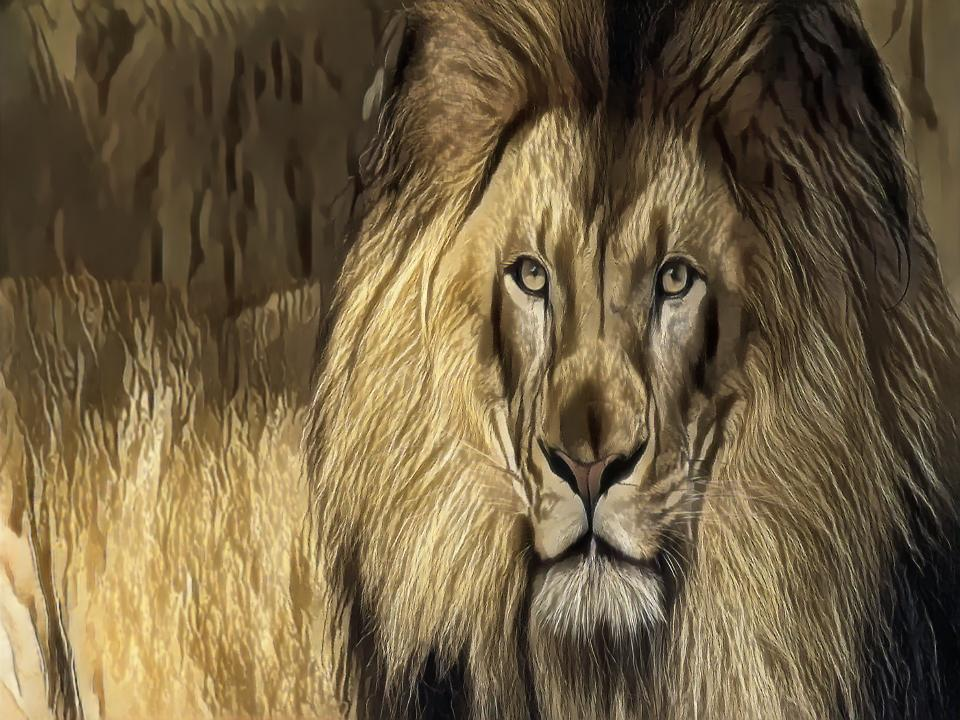
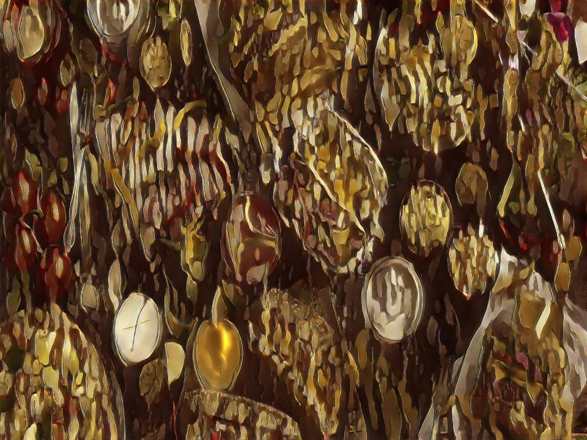
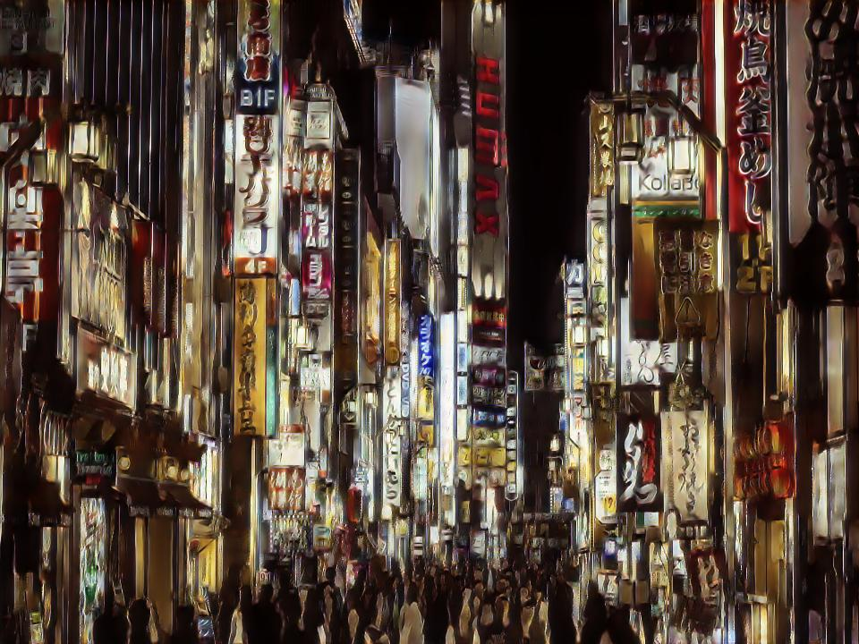

## White-Box-Cartoonization

Implementation of Paper: [Learning to Cartoonize Using White-box Cartoon Representations](https://openaccess.thecvf.com/content_CVPR_2020/papers/Wang_Learning_to_Cartoonize_Using_White-Box_Cartoon_Representations_CVPR_2020_paper.pdf)

### Introduction:
- Over the past few years, VGG models have been the go-to models for developing perceptual loss, style-transfer loss functions, and quality assessment models.
- With the rise of transformer networks, new self-attention-based quality assessment models have been developed and have better performance than their predecessors.

### Objectives:
- Experiment with two different models mainly VGG19 and VIT-16 which are used for calculating Structure and Content Losses and observe the difference in performance.
- Understanding the performance of the cartoonization process when trained only on a single dataset.

### Experiments:
- We used three different datasets in our experiments. We trained our models separately on each of these datasets with two different types of loss functions i.e. using pre-trained VGG19 or pre-trained VIT16.
- We created datasets from animes like Naruto and Attack on Titans. (Due to copyright issues, we cannot provide cartoon images used for training.)
- We also considered the dataset used by the authors in there from a famous Japanese animator "Makoto Shinkai". (Source: https://github.com/zhen8838/AnimeStylized/)

### Results: Performance on each dataset with VGG19
The first column shows the original image, and the second, third, and fourth column shows animated images generated by generators trained on Attack on Titans, Naruto, and Shinkai datasets respectively when using VGG19 in loss functions.

    

### Results: Performance on each dataset with VIT-B-16
The first column shows the original image, and the second, third, and fourth column shows animated images generated by generators trained on Attack on Titans, Naruto, and Shinkai datasets respectively when using ViT-B-16 in loss functions.

    

### Conclusions:
- When a generator is trained on the AoT dataset, we can observe a brown color palette with sharp and coarse edges.
- When a generator is trained on the Naruto dataset, we can observe smooth surfaces and edges, and slightly white-colored surfaces.
- When a generator is trained on the Shinkai dataset, we can observe a good diversity of colors and moderately sharp and coarse edges.
- When compared to VGG19, ViT heavily tries to apply the color palettes from the anime dataset during the animation process.
- The surfaces are very coarse when ViT is used instead of VGG19.
- Transformers are data-hungry models, as the size of the dataset increases, generators with ViT in loss functions perform well i.e. performance of generators trained on the Shinkai dataset is better when compared to Naruto and AoT datasets.

### References:
- X. Wang and J. Yu, "Learning to Cartoonize Using White-Box Cartoon Representations," 2020 IEEE/CVF Conference on Computer Vision and Pattern Recognition (CVPR), Seattle, WA, USA, 2020, pp. 8087-8096, doi: 10.1109/CVPR42600.2020.00811.
- https://github.com/SystemErrorWang/White-box-Cartoonization/tree/master
- https://github.com/vinesmsuic/White-box-Cartoonization-PyTorch/tree/main
- https://github.com/zhen8838/AnimeStylized/